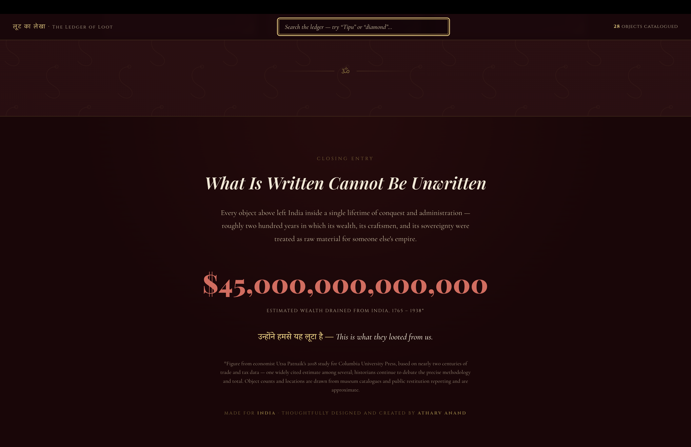

<h1>PROJECT TITLE: The Ledger of Loot</h1>

<h3>AUTHOR : ATHARV ANAND</h3>
 
<h2>How To Use The Website</h2>

  It's very simple, just open the website and you'll land on the main title page with a short intro to what the ledger is about with a background image justifying the site motto.

  

   
  Scroll down (or hit the "Descend Into the Vault" button) and you'll reach the stats section showing rough numbers on how much was taken from India during colonial rule, followed by the filter bar where you can jump straight to a specific section — > Jewels, Weapons & Armour, Thrones, Sculptures, Manuscripts,etc.

  

   
  Each chamber holds a set of item cards with a photo (wherever I've managed to find and add one), the item's origin, when it was taken, where it currently sits, and a short history of how it ended up there. There's also a search bar at the top so you can directly search for something like "Tipu" or "diamond" instead of scrolling through every chamber.

  

  

<h3>Why I made this website ?</h3>

  I made this because I feel like most people don't actually know the scale of what was taken from India during British rule —>> we hear about the Koh-i-Noor in passing, but there's hundreds of other objects, swords, thrones, manuscripts, temple artefacts sitting in museums and private collections abroad that nobody talks about. I wanted to put together a proper catalogue that documents this in one place, in a way that actually feels like you're walking through a museum instead of just reading a Wikipedia list.

<h2>Some cool features</h2>
<ul>
  <li>50 catalogued objects across 9 different "chambers" (categories) like Jewels & Royal Regalia, Weapons & Armour, Thrones & State Treasure, Sculptures & Idols and more</li>

  <li>Live search bar that filters items instantly as you type</li>

  <li>Filter section to jump straight to a specific chamber</li>

  <li>Each item card shows origin, the year/event it was taken, current location, and a short history writeup</li>

  <li>Status tags so you can see at a glance what's actually come back</li>
  <li>Hindi subtitles (Devanagari) for the site title and each chamber, since this is India's history</li>
  <li>A hero background image and Indian colonial era art style theme with gold, maroon and parchment tones</li>
</ul>

<h3> AI use </h3>

I used AI to get the data for all the 50 items ,, help in some parts of styling of the site and assistance in readme..

<h2>TECH STACK</h2>

 

 

  
</li>
  

</li>
</ul>
</body>
</html>
